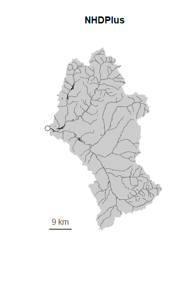
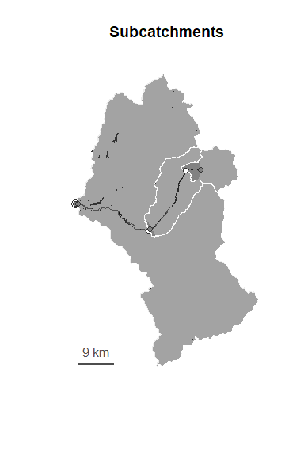
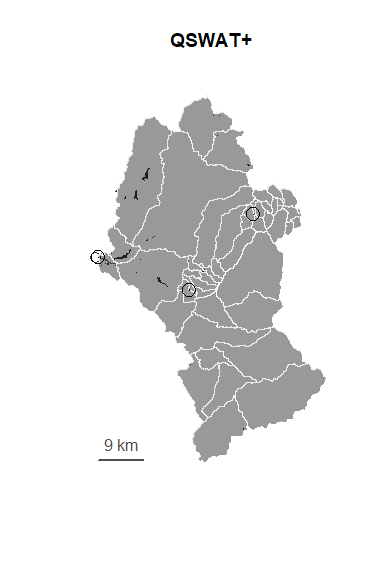
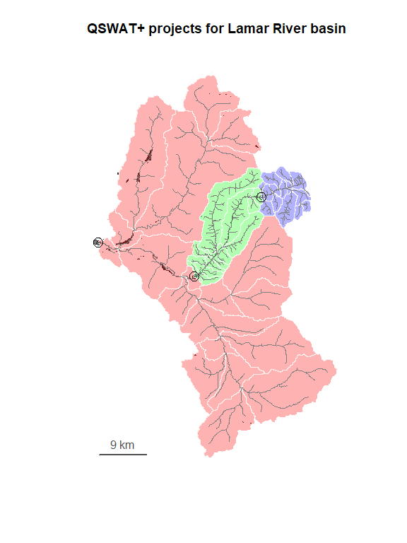

<!-- README.md is generated from README.Rmd. Please edit that file -->

# rswat.maker

An R package for building QSWAT+ inputs and creating SWAT+ projects in
Windows.



`rswat.maker` manages model creation. See also the related project
[`rswat`](https://github.com/deankoch/rswat), which handles model
execution and more.

<!-- badges: start -->
<!-- badges: end -->

## Workflow

`rswat.maker` runs a nine-step process:

1.  fetch a catchment model from NHDPlus
2.  fetch daily discharge records from NWIS (USGS)
3.  fetch a DEM raster from the NED
4.  fetch a land use raster from NLCD
5.  fetch a soil MUKEY raster from SSURGO/STATSGO2
6.  partition the catchment into sub-catchments
7.  prepare QSWAT+ input files
8.  run QSWAT+ setup
9.  run SWAT+ Editor setup

This can all be done automatically in batch mode (see `?run_maker`)
starting from an outlet location.

## Example

Check out a our [Lamar River
article](https://github.com/deankoch/rswat.maker/blob/master/vignettes/articles/lamar.md)
for a detailed walk-through of all nine steps



## Installation

You can install the development version of `rswat.maker` in R like so:

``` r
devtools::install_github('deankoch/rswat.maker')
```

This will automatically install the dependencies `nhdR`, `FedData`, and
`dataRetrieval`, if you don’t already have them.

`rswat.maker` is primarily a data-retrieval package. Users who aren’t
interested SWAT+ can complete most of the workflow (steps 1-6) without
installing it. This data-only workflow should function on platforms
other than Windows, but that has not yet been tested.

Users wanting a SWAT+ model must run the official [SWAT+
installer](https://swat.tamu.edu/software/plus/) for Windows (last
tested with v2.3.1, released 2023-07-13), as `rswat.maker` depends on
that software to complete steps 7-9.

## Background

SWAT+ is a comprehensive watershed-level water movement simulator, with
a large user base in the hydrology research community. Read more about
the simulator at its Texas A&M project
[homepage](https://swat.tamu.edu/software/plus/).

SWAT+ uses a very data-intensive modelling strategy, where the number of
unknowns can be quite large (tens- to hundreds of thousands of
parameters). However, it provides software tools with graphical
interfaces (GUIs) to assist users in setting reasonable fill-in values
for these parameters. The tools are: QSWAT+ (a QGIS plugin), and SWAT+
Editor (standalone Windows software).

I come from an R-based statistical analysis background, so my first
thought after following this workflow was to find an alternative to the
GUIs. This is because in order to properly test SWAT+/QSWAT+ (or a
modification of it), we would need to run this workflow repeatedly -
many times, with different inputs - and this is best done
programmatically, in a language like R or Python.

This package streamlines process, by collecting data inputs in R and
managing the batch execution of QSWAT+ and SWAT+ Editor via shell
scripts.

## Purpose

SWAT+ has a limited but growing presence in the R data analysis world.
The purpose of this package is to further bridge these two worlds by
offering a model-building framework that can be completed,
start-to-finish, without ever leaving the R environment. This workflow
is:

1.  reproducible
2.  programmable
3.  extensible

Easy integration with R makes a large number of statistical analysis and
GIS tools accessible to a SWAT+ modeler. Like QGIS, R (and its CRAN
packages) are open-source, free to use, and well-documented. We believe
there is a great potential to improve SWAT+ by putting it under the
microscope in R, where it can be confronted it with new methodologies
and ideas.

## Datasets

A number of different earth sciences datasets are needed to initialize a
SWAT+ model:

- landscape feature polygons - including an AOI and the water bodies in
  it
- digital elevation model raster (DEM)
- land use raster (and lookup table)
- soils classification raster (and lookup table)
- stream flow time series

`rswat.maker` takes an outlet location of interest, finds the
corresponding watershed area, then downloads and processes the required
datasets from public sources. It produces a set of output files ready
for QSWAT+, and retains copies of the source datasets for later use.

In batch mode, the workflow then proceeds to call `shell` to run QSWAT+,
followed by SWAT+ Editor. The result is a set of SWAT+ configuration
files, ready execution and training. Users can also run QSWAT+ and SWAT+
Editor manually if they wish, using the files generated by this package
as inputs in the GUI.

## Areas of interest

Unfortunately `rswat.maker` currently only supports US watersheds. This
is because the very first step, `rswat.maker` relies on geometries
downloaded from NHDplus, and these are currently only available in the
continental USA.

Our watershed of interest is the Upper Yellowstone, so most of the
testing in `rswat.maker` has focused on areas upstream of Carter’s
Bridge, Montana (near Livingston). This includes Paradise Valley and
most of Yellowstone National Park. In the vignette we look at one its
tributaries, the Lamar River.

`rswat.maker` is largely based on code in the [URYW_data
repository](https://github.com/deankoch/UYRW_data), which has been
greatly simplified so that it can be maintained as a self-contained R
package.

## Related projects

`rswat.maker` is part of a larger effort to create reproducible
workflows for SWAT+ simulations in research and improve the SWAT+ model
input methodology. See also our related packages:

- [`rswat`](https://github.com/deankoch/rswat) for managing and
  executing existing SWAT+ projects
- [`wxArchive`](https://github.com/deankoch/wxArchive) for creating and
  maintaining a weather database
- [`snapKrig`](https://github.com/deankoch/snapKrig) for down-scaling
  raster data

## Development to-do list

- CRAN checks
- Lamar River vignette
